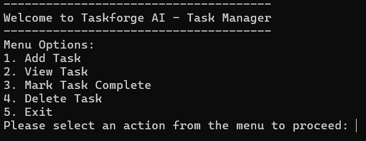
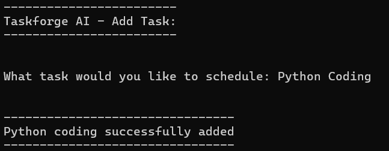
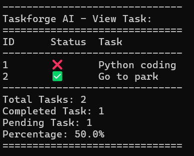
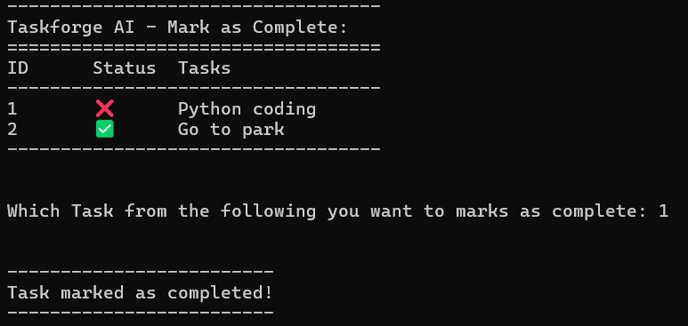
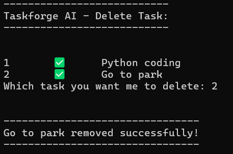
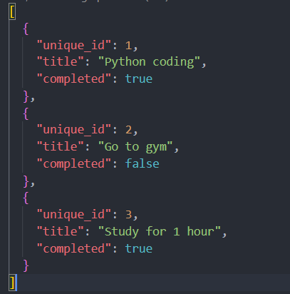

# 🚀 TaskForge AI

> A modern command-line task management application built with Python using Object-Oriented Programming and JSON data persistence.


---

## 📖 About

TaskForge AI is a Python-based command-line task manager that helps users organize their daily tasks efficiently.

Users can add, view, complete, and delete tasks through a simple terminal interface. All tasks are automatically saved in a JSON file, ensuring data is preserved between program sessions.

The project was built to strengthen my understanding of Python, Object-Oriented Programming (OOP), file handling, JSON data persistence, input validation, and writing clean, maintainable software.

---

## ✨ Features

- ➕ Add new tasks
- 📋 View all tasks
- ✅ Mark tasks as completed
- 🗑️ Delete tasks by ID or task name
- 💾 Automatic JSON data persistence
- 📊 Task statistics
  - Total tasks
  - Completed tasks
  - Pending tasks
  - Completion percentage
- ⚠️ Input validation and exception handling
- 🏗️ Object-Oriented design
- 🖥️ Interactive command-line interface

---

## 🏛️ Project Architecture

```text
TaskForge AI
│
├── TaskForgeAI
│
├── JSON Storage
│
├── Statistics Engine
│
├── Menu System
│
└── Helper Module
```

Each component has a dedicated responsibility, making the application easier to understand, maintain, and extend.

---

## 🛠️ Technologies Used

- Python
- JSON
- pathlib
- Object-Oriented Programming (OOP)
- File Handling
- Exception Handling

---

## 📂 Project Structure

```text
TaskForge-AI/

│── main.py
│── helper.py
│── tasks.json
│── README.md
│
└── screenshots/
    ├── menu.png
    ├── add-task.png
    ├── view-task.png
    ├── complete-task.png
    ├── delete-task.png
    └── json-file.png
```

---

## 🚀 Installation

Clone the repository:

```bash
git clone https://github.com/its-razahasnain/taskforge-ai.git
```

Move into the project:

```bash
cd taskforge-ai
```

Run the application:

```bash
python main.py
```

---

## 📷 Screenshots

### 🏠 Main Menu



---

### ➕ Adding a Task



---

### 📋 Viewing Tasks



---

### ✅ Marking a Task as Complete



---

### 🗑️ Deleting a Task



---

### 💾 JSON Data Storage



---

## 📄 Sample Output

```text
------------------------------
TaskForge AI - View Tasks
==============================
ID   Status   Task
------------------------------
1    ❌       Learn Python
2    ✅       Complete Portfolio
3    ❌       Practice Algorithms
------------------------------
Total Tasks: 3
Completed: 1
Pending: 2
Completion: 33.33%
==============================
```

---

## 🎯 Learning Outcomes

This project helped me practice:

- Python fundamentals
- Object-Oriented Programming (OOP)
- File handling
- JSON data persistence
- Input validation
- Exception handling
- Modular programming
- Building command-line applications
- Writing clean and maintainable code

---

## 🔮 Future Improvements

- ✏️ Edit existing tasks
- 🔍 Search tasks
- ⭐ Task priorities
- 📅 Due dates
- 🏷️ Task categories
- 🎨 Colored terminal output
- 📤 Export tasks to CSV
- 🗄️ SQLite database support
- 🧪 Unit testing

---

## 👨‍💻 Author

**Hasnain Raza**

Aspiring Python & AI Developer

- GitHub: https://github.com/its-razahasnain
- LinkedIn: https://linkedin.com/in/hasnainraza-pk

---

## ⭐ Support

If you found this project useful, consider giving it a ⭐ on GitHub.
